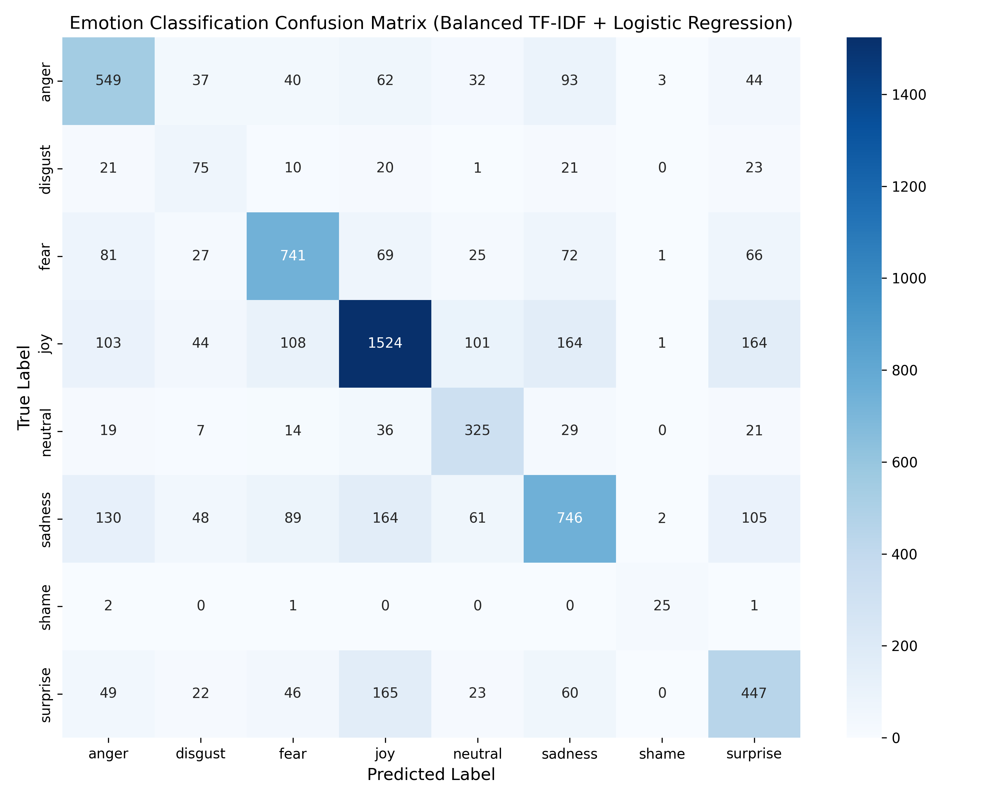

# 🎭 Text Emotion Detection

An end-to-end NLP system and interactive Streamlit web application for real-time text emotion detection with class-imbalance correction, negation awareness, and confidence thresholding.

---

## 🌟 Key Features

- **8 Emotion Classes Supported:** `joy`, `sadness`, `anger`, `fear`, `surprise`, `neutral`, `disgust`, and `shame`.
- **Class-Imbalanced Handling:** Employs balanced class weighting (`class_weight='balanced'`) to prevent majority class dominance (e.g. defaulting to `joy`).
- **Context & Negation Awareness:** Uses TF-IDF with Unigrams and Bigrams (`ngram_range=(1, 2)`) alongside regex preprocessing that preserves negations like *"not happy"*, *"no"*, *"never"*.
- **Confidence Threshold & Rejection Logic:** Automatically flags low-confidence or non-emotional physical states (e.g. *"i am hungry"*, *"tomorrow is Tuesday"*) as **Uncertain / Neutral** instead of forcing a low-confidence false label.
- **Interactive Streamlit UI:** Real-time emotion classification, confidence metric score, interactive Altair probability breakdown chart, and adjustable sidebar confidence slider.

---

## 📊 Model Evaluation & Metrics

Evaluated on a **20% Stratified Test Split (6,959 samples)** from the raw emotion dataset:

| Emotion Class | Precision | Recall | F1-Score | Support |
| :--- | :---: | :---: | :---: | :---: |
| **Anger** | 57.55% | 63.84% | 60.53% | 860 |
| **Disgust** | 28.85% | 43.86% | 34.80% | 171 |
| **Fear** | 70.64% | 68.48% | 69.54% | 1,082 |
| **Joy** | 74.71% | 68.99% | 71.73% | 2,209 |
| **Neutral** | 57.22% | 72.06% | 63.79% | 451 |
| **Sadness** | 62.95% | 55.46% | 58.97% | 1,345 |
| **Shame** | 78.12% | 86.21% | 81.97% | 29 |
| **Surprise** | 51.32% | 55.05% | 53.12% | 812 |
| **Overall Accuracy** | — | — | **63.69%** | 6,959 |
| **Macro Average** | **60.17%** | **64.24%** | **61.81%** | 6,959 |
| **Weighted Average** | **64.71%** | **63.69%** | **63.99%** | 6,959 |

### Confusion Matrix


---

## 📁 Repository Structure

```
├── data/
│   └── emotion_dataset_raw.csv    # Raw training dataset
├── model/
│   └── text_emotion.pkl           # Exported scikit-learn TF-IDF + Classifier pipeline
├── streamlit_app/
│   └── app.py                     # Interactive Streamlit web application
├── Notebook/
│   └── text emotion detction.ipynb # Jupyter notebook for experimentation
├── train_model.py                 # End-to-end training, evaluation & model export script
├── confusion_matrix.png           # Evaluated confusion matrix heatmap
├── requirements.txt               # Dependencies list
├── .gitignore                     # Git ignore file
└── README.md                      # Project documentation
```

---

## 🚀 Getting Started

### 1. Clone the Repository
```bash
git clone https://github.com/dipakpatil8832/Text-Emotion-detection.git
cd Text-Emotion-detection
```

### 2. Install Dependencies
```bash
pip install -r requirements.txt
```

### 3. Run the Streamlit Web Application
```bash
streamlit run streamlit_app/app.py
```

### 4. Retrain the Pipeline (Optional)
To retrain the model and regenerate the evaluation metrics and confusion matrix:
```bash
python train_model.py
```

---

## 🛠️ Tech Stack
- **Language:** Python 3.x
- **NLP & ML:** scikit-learn, NLTK, Pandas, NumPy
- **App & Visualization:** Streamlit, Altair, Matplotlib, Seaborn
- **Serialization:** Joblib
